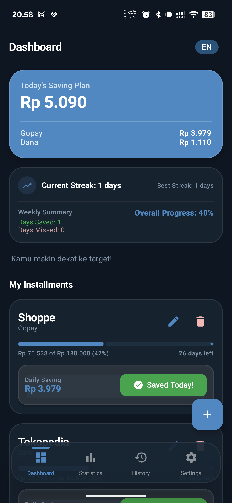
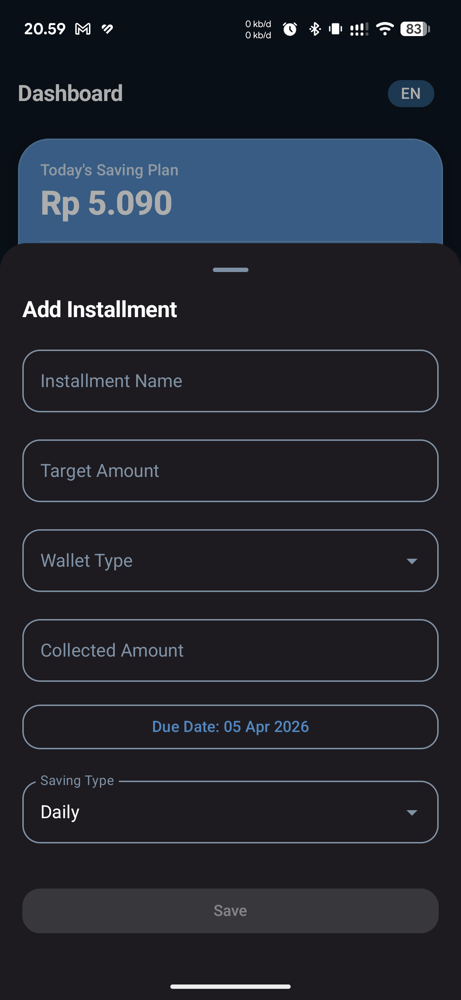
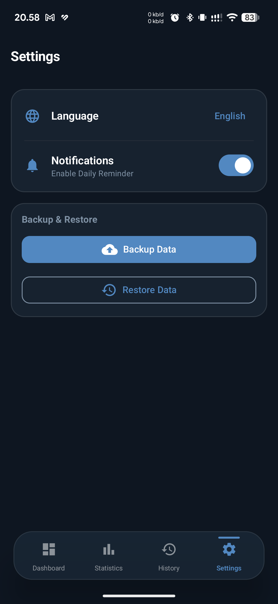
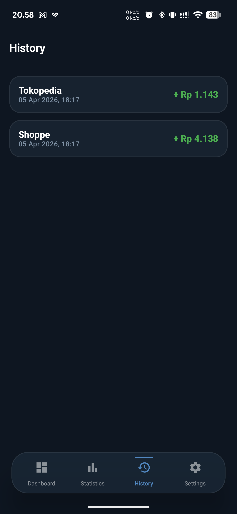
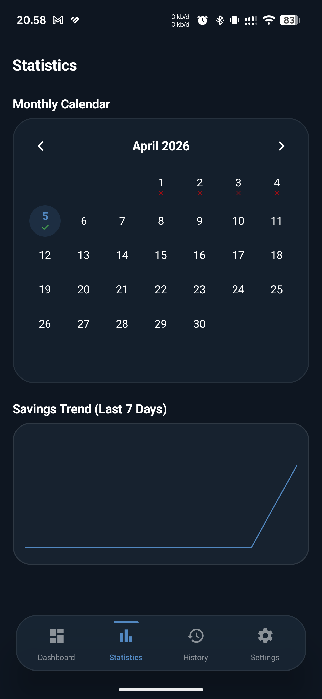
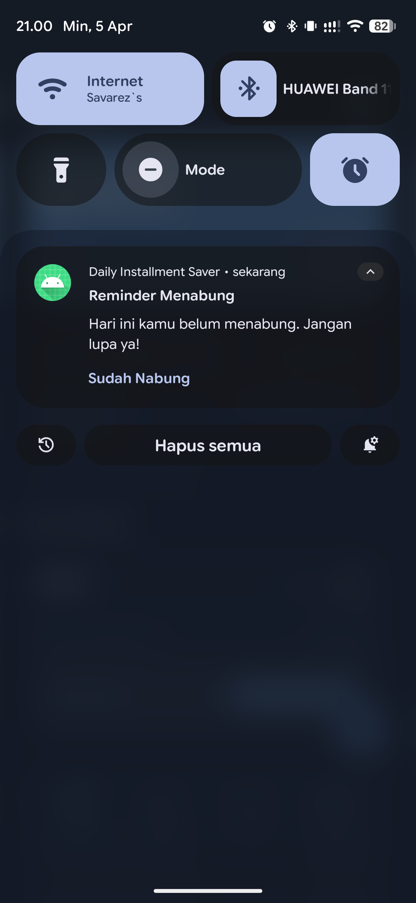

# DailyInstallmentSaver 💰

DailyInstallmentSaver is a simple yet powerful Android app built with **Jetpack Compose** to help you track and manage your daily savings for various installments. It calculates exactly how much you need to save every day based on your target amount and due date.

## ✨ Features

- **Dashboard**: View all active installments and your total daily saving target.
- **Add Installment**: Easily input installment name, total amount, wallet type, and due date.
- **Auto-Calculation**: Automatically computes daily savings (Amount / Days Left).
- **Daily Notifications**: Get reminded every day with a summary of what you need to save.
- **Localization**: Supports English and Indonesian.
- **Offline First**: Uses Room Database for local data persistence.

## 🛠 Tech Stack

- **Language**: Kotlin
- **UI Framework**: Jetpack Compose
- **Database**: Room
- **Architecture**: MVVM (Model-View-ViewModel)
- **Background Tasks**: WorkManager (for Notifications)
- **Navigation**: Navigation Compose

## 🚀 Installation

1. Clone this repository.
2. Open the project in **Android Studio**.
3. Sync Gradle and ensure SDK 33+ is installed.
4. Run the app on an emulator or physical device.

## 📱 Usage

1. Tap the **FAB (+)** button to add a new installment.
2. Fill in the details and pick a due date.
3. View your daily saving requirement on the Dashboard.
4. Receive a notification every day summarizing your saving goals.

## 📸 Screenshots

<table align="center">
  <tr>
    <td align="center">
       
      <b>Dashboard</b>
    </td>
    <td align="center">
       
      <b>Add Installment</b>
    </td>
    <td align="center">
       
      <b>Settings</b>
    </td>
  </tr>
  <tr>
    <td align="center">
       
      <b>History</b>
    </td>
    <td align="center">
       
      <b>Statistics</b>
    </td>
    <td align="center">
       
      <b>Notification</b>
    </td>
  </tr>
</table>

## 📄 License

This project is licensed under the MIT License.
